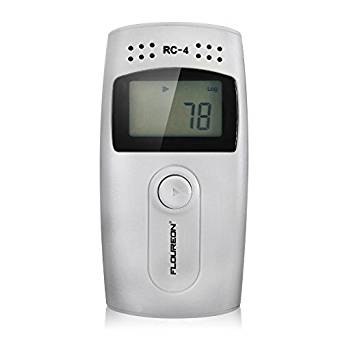
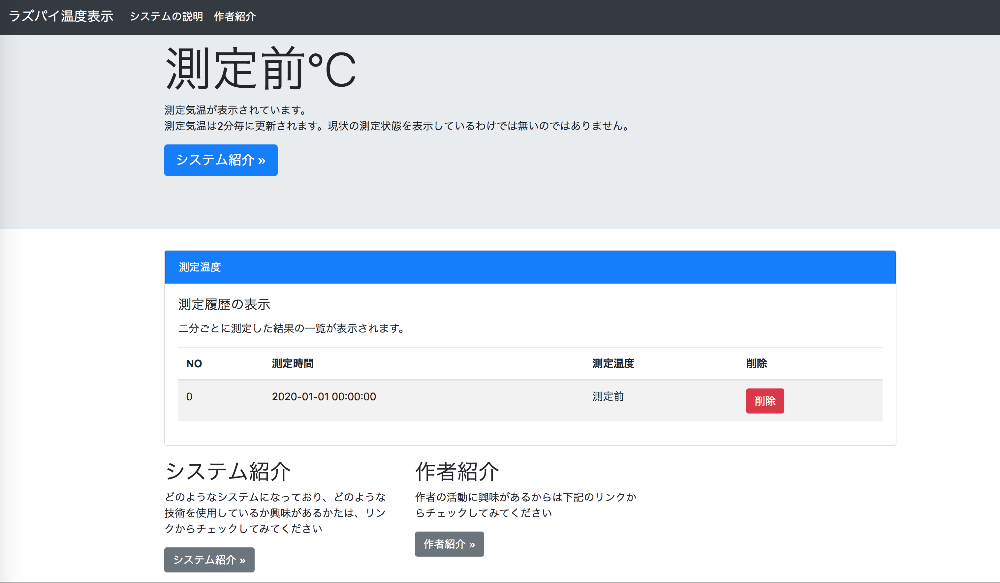

<!-- $theme: gaia -->
<!-- page_number: true -->

## ド素人がIoTに挑戦

----

# 自己紹介
- 名前	 : KKimishima
- Twitter :@k_kimikatsu123
- github	:KKimishima
- 仕事	 : 茨木の工場の管理部門
- プログラム歴　:趣味の独学2年
- 好きな言語 Java,Python,Ruby
- 最近のHack
RubyのSinatraでフルスクラッチでブロク作製中

---

# hobbyプログラマーです
# チャンスがありば仕事にすることを考えてます!!

---

# ほぼはじめてのLTなので
# 生温かい目で見てください!!!

---

## 世間ではIotが流行っている!?
#### *自分*も手軽にお金をかけずにIoTやってたい!!!
#### なんとかやってみたい!!!
#### ド素人なので下記は点は目をつぶってください
- ~~セキュリティ~~
- ~~スケール~~
- ~~継続性~~

---

# 今回使用した
# 手軽でお金がかからない物!!!

---


- 温度センサー　Eltech RC-4
- 職場から貰った中国製安価温度センサー
- 無料 (~~2,000円~~)

---


- レシバー raspberryPi3B  
- 買ってから全く使っていない可愛そうなラズパイ
- 無料(~~5,220円~~)

---


- ホスティングサービス heroku
- freeプランでやってみる
- 無料
---

# やったこと
- RaspberryPiに温度センサーRC-4を取り付け
- Pythonで2~3分ごとにデータ測定データをhttpリクエスト送る
- Heroku上にデプロイしたWebアプリがリクエストをキャッチ表示する
- いい感じにWeb上に表示する

---
### こんな感じです


<!-- ---

# 実演!!!


--- -->
---

RaspberryPiのpythonのコード
civic Sasakiさんの "elitech-datareader"
https://pypi.org/project/elitech-datareader/

```python
import time,json,requests
import elitech
# ドライバの設定
device = elitech.Device("/dev/ttyUSB0")
app_url = "https://hogehoge.com/"
headers = {'content-type': 'application/json'}
# 無限ループ
while True:
    body = device.get_latest()
    temp_data = {"id":str(body[0]),"datetime":str(body[1]),
        　　　"temp":str(body[2])}
    requests.post(app_url,data=json.dumps(temp_data),
    		                      headers=headers)
    time.sleep(120)
```

---
Spring bootにWebApiを作製
```
- 温度データ登録

POST /api/v1/temp

- 全件温度データ取得

GET /api/v1/temp

- 最後の一件の温度データ取得

Get /api/v1/temp/last

- 一件削除
DELETE /api/v1/temp/:id

- 全件削除
DELETE /api/v1/temp
```

---

いい感じのwebサイトをjqruryとboostrapで作製
jsが苦手なので出来は良くないです...


---

# まとめ
- ド素人でも手軽に~~ほとんど~~お金をかけずにIoTっぽいのは作れた!?
- herokuのfreeプランだと24時間起動ができないので、hobbyプランかAWSでやってみたい
- 次回は、セキュアなIotを目指したい
- 自画自賛
